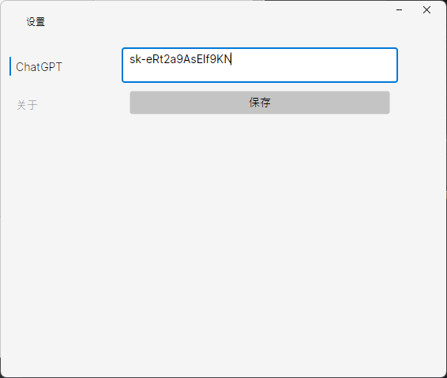
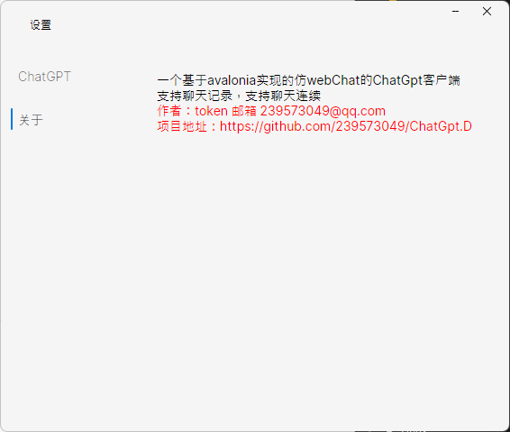
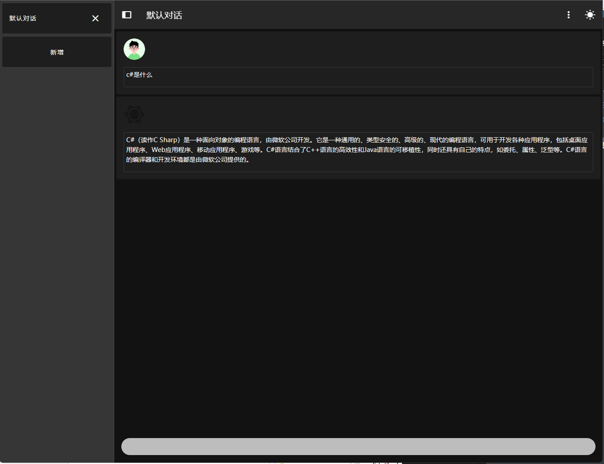
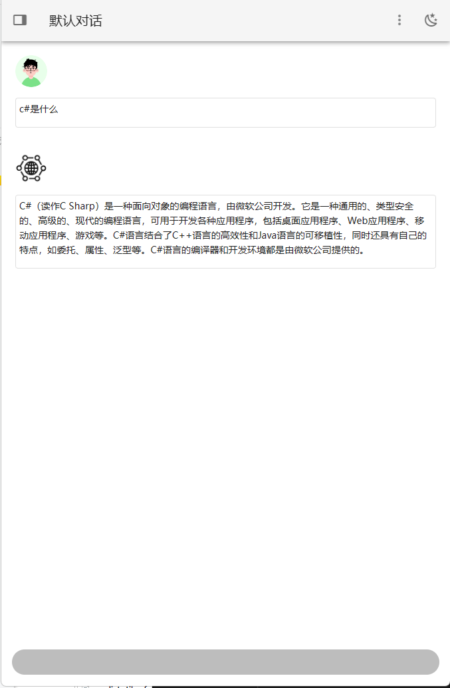
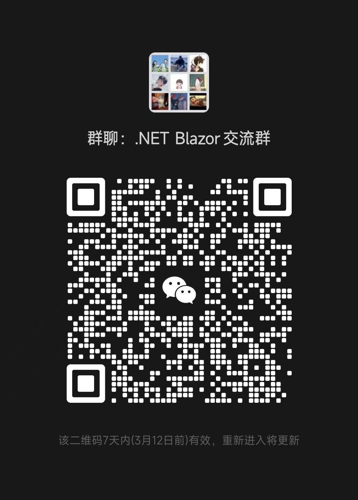

# ChatGpt.Desktop

## 介绍
一个基于avalonia实现的仿webChat的ChatGpt客户端
支持聊天记录，支持聊天连续

## 软件架构
使用`Avalonia`作为跨平台支持 `.NET 7`，界面仿制`WebChat`

## 使用说明

1.  打开设置 => 设置ChatGpt的token
2.  保存设置
3.  输入需要提问的问题
4.  得到答案
5.  右键回复内容可直接复制内容

## 搭建ChatGpt代理

实现准备一台海外服务器，新加坡或者其他国家的，

需要准备docker和docker compose的环境

使用以下脚本部署代理服务，请注意代理服务只代理api.openai.com的接口，部署完成再应用中设置`ApiUrl`为服务器的地址，http://服务器ip:服务器端口//v1/chat/completions

```yml
services:
  chatgpt:
    image: registry.cn-shenzhen.aliyuncs.com/tokengo/chatgpt-gateway
    container_name: chatgpt
    ports:
      - 1080:80
```


## 参与贡献

1.  Fork 本仓库
2.  新建 feature/xxx 分支
3.  提交代码
4.  新建 Pull Request

## 预览图









## 获取ChatGpt token

实现需要一个ChatGpt账号并且登录然后访问一下地址，创建token
https://platform.openai.com/account/api-keys


## 结尾

欢迎大佬给项目PR，来自热爱开源的token

学习交流qq群：737776595

wx: 

