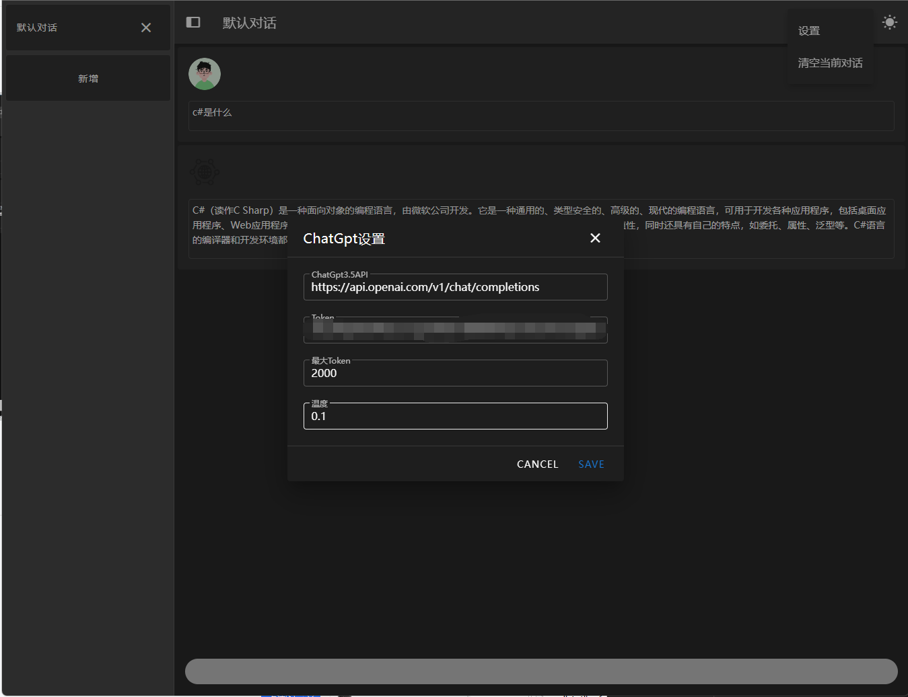

# ChatGpt.Desktop

## 介绍
Blazor实现的ChatGpt界面简洁的界面，让用户更容易理解，支持多个对话，

## 支持平台：

Android，IOS，Mac，Linux，Win，Web

## 软件架构
使用`Blazor`作为跨平台UI，
使用Masa Blazor界面

## 使用说明

1.  打开右上角功能按钮点击设置
1.  设置token，如果自己有代理服务器可以修改api地址为自己代理服务器
1.  设置完成，保存，
1.  发送消息，得到答案
1.  消息会保存到浏览器缓存，可以在设置中清楚当前对话缓存

## 搭建ChatGpt代理

实现准备一台海外服务器，新加坡或者其他国家的，

需要准备docker和docker compose的环境

使用以下脚本部署代理服务，请注意代理服务只代理api.openai.com的接口，部署完成再应用中设置`ApiUrl`为服务器的地址，http://服务器ip:服务器端口//v1/chat/completions

```yml
services:
  chatgpt:
    image: registry.cn-shenzhen.aliyuncs.com/tokengo/chatgpt-gateway
    container_name: chatgpt
    ports:
      - 1080:80
```

## 如何使用Web Server

当前项目根目录下存在`docker-compose.yml`文件，可以在服务器直接运行，这是一个Blazor Server的项目镜像，如果将其部署到国外服务器就无需翻墙即可访问`ChatGpt Api`

```yaml
services:
  chat-server:
    image: registry.cn-shenzhen.aliyuncs.com/tokengo/chat-server
    build:
      context: .
      dockerfile: ./src/ChatGpt.Server/Dockerfile
    container_name: chat-server
    ports:
      - 1800:80
```

## 参与贡献

1.  Fork 本仓库
2.  新建 feature/xxx 分支
3.  提交代码
4.  新建 Pull Request

感谢以下贡献者

<a href="https://github.com/239573049/ChatGpt.Desktop/graphs/contributors">
  
</a>

## 预览图




## 获取ChatGpt token

实现需要一个ChatGpt账号并且登录然后访问一下地址，创建token
https://platform.openai.com/account/api-keys


## 结尾

欢迎大佬给项目PR，来自热爱开源的token

学习交流qq群：737776595

wx: 

